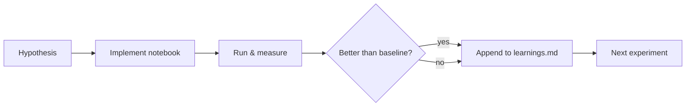
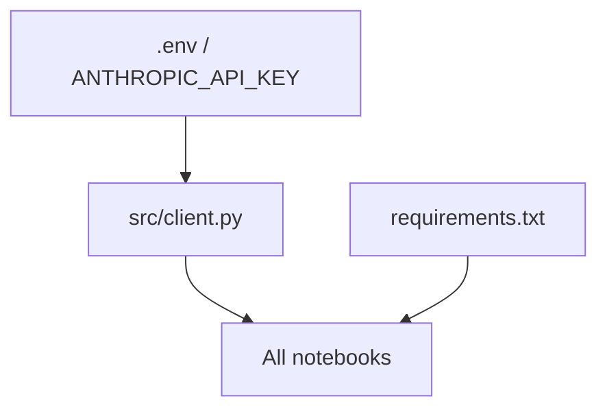

# Architecture

## Repository layout

```
ai-systems-lab/
├── notebooks/
│   ├── 01_embeddings/   ← embedding generation & similarity
│   ├── 02_rag/          ← retrieve-then-generate pipelines
│   ├── 03_agents/       ← tool-use agent implementations
│   └── 04_fine_tuning/  ← fine-tuning experiments
├── src/
│   └── client.py        ← shared Anthropic client
├── data/                ← local datasets (gitignored except .gitkeep)
├── obsidian-vault/      ← knowledge management
└── docs/                ← this directory
```

## Experiment pipeline



## Dependency graph


