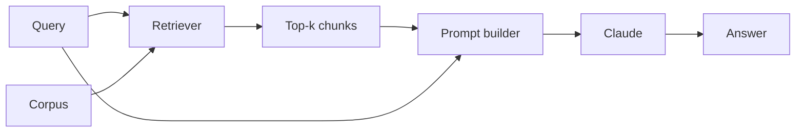

# Experiments

## Design principles
- Isolate one variable per experiment (change retrieval strategy, not retrieval + prompt simultaneously)
- Always have a baseline to compare against
- State the hypothesis before writing code
- Measure with numbers, not just "it seems better"

## Experiment domains

### 01 — Embeddings
What we measure: cosine similarity, cluster quality (silhouette score), retrieval accuracy (recall@k).
Baseline: random retrieval.

### 02 — RAG
What we measure: answer relevance (1–5 manual score), faithfulness (is answer grounded in context?), latency.
Baseline: keyword overlap retrieval + direct prompt.

### 03 — Agents
What we measure: task success rate (did it complete the task?), tool call efficiency (calls needed), error rate.
Baseline: single-shot prompting (no tools).

### 04 — Fine-tuning
What we measure: accuracy delta vs. prompted baseline, cost per correct answer.
Baseline: prompted claude-sonnet-4-6.

## Evaluation rubric
| Score | Meaning |
|-------|---------|
| 5 | Correct, complete, no hallucination |
| 4 | Correct, minor gaps |
| 3 | Partially correct |
| 2 | Mostly wrong but relevant |
| 1 | Wrong / off-topic |
