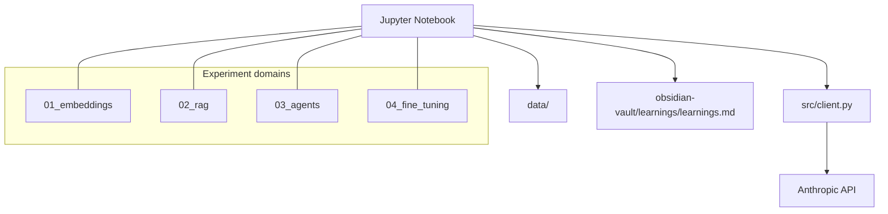
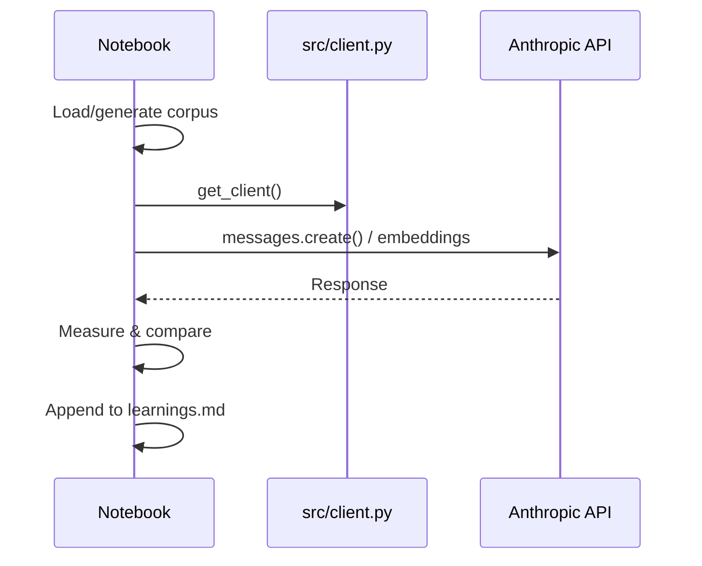

# System Design

## High-level architecture

## Data flow per experiment

## Deliberate constraints
- No vector database — NumPy in-memory for Phase 1
- No framework abstractions — every API call is explicit
- Single shared client helper (`src/client.py`) — all else is notebook-local
